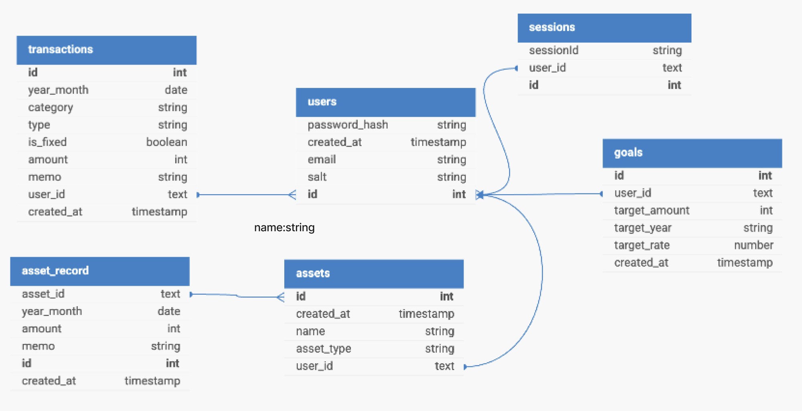
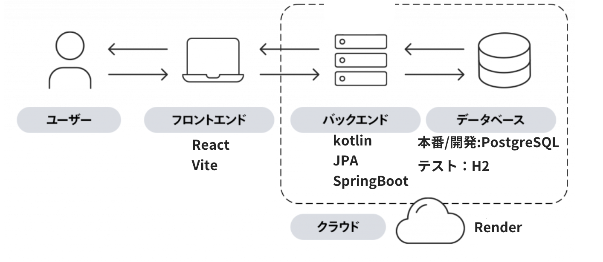

# 📈 家計簿・資産管理ツール

家計簿と資産記録をつける管理ツールです。

構成は下記です。

```
Housekeeping and asset management apps/
├── client/           # React+vite フロントエンド
├── server/           # Node.js + Express バックエンドAPI + postgreDB
└── README.md
```

## アプリ概要

毎月の支出と収入、資産を記録して、お金持ちになろう！
収支や資産は時系列でチャートで視覚的に見ることができる！
目標資産、目標年、年利を設定すれば、毎月何万円積立すれば達成可能なのかも教えてくれます！

## 🖥 使用技術

- フロントエンド React,vite
- バックエンド Springboot, JPA, kotlin, PostgreSQL
- その他 Docker, Render

[](https://skillicons.dev)

## ER 図



## 🗺️ アーキテクチャ図



## 🚀 起動方法
IntelliJでの起動を想定しています。
- [ ] このレポジトリをクローンした後、 `cd client && npm install` を実行して必要なパッケージをインストールしてください。
- [ ] 次の作業では、 `npm run build:deploy` を実行して client のコードをビルドし、server側の`server/src/main/resources/static`にコピーします。
- [ ] 次の作業では、ローカル環境で Postgres が起動している必要があります。Postgres のインスタンスを起動し、`asset_management_app` という名前のデータベースを作成してください。
  > **補足**: データベースを作成するための `psql` クエリは `CREATE DATABASE asset_management_app;` です。
- [ ] 次の作業では、IntelliJで左上バーでRun -> Edit Configuration -> Active Profileで`dev`で記入しOKにしてください。設定ファイルapplication-dev.propertiesを読み込む設定です。
- [ ] `ServerApplication` を使ってアプリを起動し、ブラウザで `localhost:8080` にアクセスしてください
  > **補足**: アプリ実行コマンド：./gradlew bootrun、アプリのビルドコマンド：./gradlew build　です。server側にcdして実行ください。

## 🔄 機能一覧

- DashBoardでの年間収支、年間資産推移のチャート表示
- 月の収支入力機能
- 現在の資産入力機能、修正、削除機能
- 資産目標に対するチャート機能、必要な月の積立額表示機能。

## 🤔 今後追加予定機能

- 月の収支の過去履歴閲覧、修正、削除機能
- 収支記入、資産記入ページで新規カテゴリの登録できるようにする
- AIによるasset提案
- 支出や資産のレポート機能
- LifePlan機能

